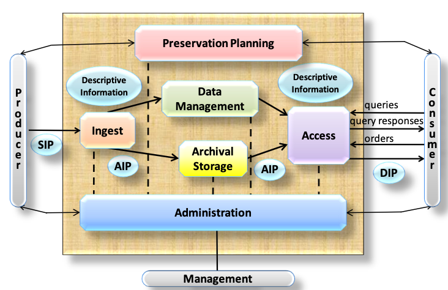

## Data Repositories

**Data repositories** support the **archiving**, **curation**, and **publication** of research data. Their core function is to take **stabilised files** and assemble them into a governed **digital object** with structured metadata, a persistent identifier, and controlled access.

In principle, repository *software* can support **archiving without full publication**, for example by keeping files dark or access‑restricted. In practice, however, many repository *services* are designed with **publication as the default outcome**. To soften this, they typically offer:

- **embargo periods**, during which files are not yet openly accessible  
- **restricted files**, where access requires approval  

Even in these cases, the **repository entry (landing page)** and its basic metadata are usually **publicly visible**, while the underlying files may be delayed or restricted.

Repositories operate primarily at the **dataset level**. They expect researchers to prepare a coherent data package consisting of:

- one **metadata record**  
- one **persistent identifier**  
- one **landing page**  

File‑level metadata may be supported, but it is typically **secondary**. Repositories are therefore optimised for **curation, governance, and long‑term retention of stabilised datasets**, not for managing the volatile, rapidly changing files produced during active research.

Repositories typically provide:

- structured **publication workflows** (draft → review → publish)  
- **embargo** and **restricted‑access** options  
- defined **roles** (depositors, curators, administrators)  
- **access controls** aligned with institutional or funder policies  
- **archival packaging** (e.g., BagIt, dataset bundles)  
- limited or single‑backend **storage coordination**  

In short, repositories excel at turning stabilised files into **citable, discoverable, and preservable digital objects**, but they are not designed to orchestrate large‑scale or frequently changing data during **active research**. That role belongs to **policy engines**, which operate earlier in the lifecycle.

### The Repository Workflow

```{mermaid}
%%| label: fig-1
%%| fig-cap: Data repositories implement a structured publication workflow that transforms a bundle of stabilised files into a single governed digital object. The workflow focuses on dataset‑level metadata, packaging, and persistent identifiers rather than elevating individual files to independent objects.
%%| fig-align: center
%%{init: {"look": "handDrawn","flowchart": { "htmlLabels": false }}}%%
flowchart TB

    subgraph R["Data Repository Workflow"]
    
        A["Deposit<br/>(Upload files + enter metadata)"]
        B["Curation / Review<br/>(Metadata checks, structure, policy compliance)"]
        C["Approval<br/>(Embargo, access rights, final validation)"]
        D["Publication<br/>(Assign PID, freeze version, create landing page)"]
        E["Post‑Publication<br/>(Versioning, access requests, metadata updates)"]
        
    end

    A --> B --> C --> D --> E
```

A repository transforms a bundle of files into a **citable, discoverable, governed digital object**.

## Repository Platforms
The following platforms illustrate how these repository principles are implemented in practice.

### Dataverse

Dataverse is strongly dataset‑centric: the dataset is the primary digital object, and all files are organised within that structure.

- a metadata record based on disciplinary templates  
- versioning across drafts and releases  
- a clear publication workflow  
- a DOI  

Dataverse supports:

- embargoes  
- restricted files with request workflows  
- file‑level metadata  
- tabular data ingest (extracting variables, labels, formats)  
- dataset‑level citations  

It is ideal for institutions that want a **curation‑centric** repository with well‑defined roles and governance.

---

### Figshare

Figshare focuses on **ease of deposit** and **broad dissemination**. It supports many output types and provides:

- drag‑and‑drop upload  
- minimal required metadata  
- private workspaces  
- clean landing pages  
- metrics dashboards (views, downloads, citations)  
- embargoes and controlled access  
- ORCID integration  

Figshare is ideal when the goal is to make research outputs **easy to publish and easy to find**.

---

### Invenio / Zenodo

**Invenio** is a modular repository framework used to build institutional and disciplinary repositories.  
**Zenodo**, built on Invenio, is a public repository offering free long‑term hosting.

Invenio supports:

- configurable deposit forms  
- metadata schemas  
- review and curation workflows  
- DOI registration  
- access control  
- landing pages  

Zenodo supports:

- any file type  
- automatic DOI assignment  
- concept DOIs and version DOIs  
- GitHub integration (archiving releases automatically)  
- long‑term preservation  

Zenodo is widely used for **software**, **code releases**, and **small to medium‑sized datasets**.

## Archival Packaging and Preservation Standards

Data repositories do more than curate and publish datasets—they also support the **long‑term preservation** of digital objects. To do this reliably, repositories rely on a set of **archival packaging formats**, **metadata standards**, and **preservation models** that ensure data remains interpretable, verifiable, and transferable over decades.

The most widely used frameworks in this space include **BagIt**, **OAIS**, **PREMIS**, **METS**, and **RO‑Crate**.  
Each addresses a different part of the preservation problem.

### BagIt: Packaging Files for Transfer and Fixity

**BagIt** is a simple, robust packaging format used to bundle files together with the metadata needed to verify their integrity.

A BagIt “bag” contains:

- a **data/** directory with the files  
- **manifest files** with checksums (fixity information)  
- optional **tag files** with descriptive or administrative metadata  

A minimal BagIt directory might look like this:
```
mydataset-bag/
├── bagit.txt
├── bag-info.txt
├── manifest-sha256.txt
└── data/
    ├── results.csv
    └── readme.txt

```
- bagit.txt declares the BagIt version and encoding:
	
	```
	BagIt-Version: 1.0
	Tag-File-Character-Encoding: UTF-8
	```
	
- bag-info.txt conatins high-level metadata about the "bag"
	
	```
	Bag-Software-Agent: Example BagIt Creator 1.0
	Bagging-Date: 2024-05-01
	Contact-Name: Research Data Team
	``` 
- manifest-sha256.txt contains the checksums for all files in `/data`:
 
 	```
 	3a7bd3e2360a3d...  data/results.csv
	b1946ac92492d...  data/readme.txt
 	```

Repositories use BagIt because it:

- ensures **fixity** through checksums  
- supports **validation** after transfer  
- is **storage‑agnostic**  
- works well for **large datasets**  

Many repositories generate BagIt packages for archival export or transfer to preservation systems.


### OAIS: The Conceptual Model Behind Preservation

The **OAIS Reference Model** (Open Archival Information System) is the foundational conceptual framework for digital preservation. It defines six functional entities that together define how a trustworthy digital archive operates.

- Ingest handles the acceptance of Submission Information Packages (SIPs) from producers. It performs quality checks, prepares Archival Information Packages (AIPs) according to the archive’s standards, creates or gathers descriptive metadata, and coordinates the transfer of AIPs into archival storage.

- Archival Storage is responsible for the storage, maintenance, and retrieval of AIPs. It adds new AIPs to long‑term storage, manages storage hierarchies, performs fixity checks and media refreshment, supports disaster recovery, and supplies AIPs to the Access function when requested.

- Data Management maintains the archive’s descriptive metadata and administrative information. It manages database schemas, loads new metadata, executes queries, and produces reports needed for discovery, administration, and audit.

- Administration oversees the operation and governance of the archive. It negotiates submission agreements, audits incoming SIPs, manages system configuration, monitors performance, maintains policies and standards, and supports users and producers.

- Preservation Planning monitors the technology environment and the needs of the designated community. It recommends format migrations, updates to AIPs, risk assessments, and preservation strategies. It also designs templates for SIPs and AIPs and develops plans and prototypes to ensure long‑term accessibility.

- Access provides services that allow consumers to discover, request, and obtain information from the archive. It manages user requests, applies access controls, coordinates the delivery of Dissemination Information Packages (DIPs), and generates query responses and reports.



Most repositories implicitly follow OAIS principles, even if they do not implement the full model.

*References*
- https://ccsds.org/Pubs/650x0m3.pdf, pp. 4-1


### PREMIS: Preservation Metadata for Long‑Term Stewardship

**PREMIS** (Preservation Metadata: Implementation Strategies) is the most widely adopted standard for **preservation metadata**, i.e. information needed to ensure long‑term usability and authenticity.

PREMIS describes:

- **objects** (files, bitstreams, representations)  
- **events** (ingest, fixity checks, migrations)  
- **agents** (people, software, systems)  
- **rights** (permissions, licenses)  

Repositories and preservation systems use PREMIS to document:

- fixity checks  
- format migrations  
- provenance events  
- authenticity and integrity  
- preservation actions over time  

PREMIS is expressed in XML and often embedded inside METS or other packaging formats.

### METS: Structuring Complex Digital Objects

**METS** (Metadata Encoding and Transmission Standard) is an XML‑based framework for describing the **structure** of complex digital objects and linking them to metadata.

A METS document can include:

- **structural maps** (how files relate to each other)  
- **administrative metadata** (technical, rights, provenance)  
- **descriptive metadata** (often embedded or referenced)  
- **file inventories**  

METS is commonly used in:

- digital libraries  
- institutional archives  
- preservation systems that need rich structural description  

Repositories may use METS internally or for archival export.

### RO‑Crate: Lightweight, Web‑Native Research Object Packaging

**RO‑Crate** is a modern, web‑native packaging format designed for **research objects**, especially those involving workflows, software, and computational provenance.

An RO‑Crate consists of:

- a **crate directory**  
- a **JSON‑LD metadata file** describing all files and their relationships  
- optional workflow, provenance, or software metadata  

RO‑Crate is designed for:

- FAIR workflows  
- reproducible research  
- machine‑actionable metadata  
- integration with workflow engines and policy engines  

It complements, rather than replaces, traditional archival formats like BagIt.

---

## How These Standards Fit Together

These standards address different layers of preservation:

- **BagIt** — packages files and ensures fixity  
- **OAIS** — defines the conceptual preservation lifecycle  
- **PREMIS** — records preservation events and provenance  
- **METS** — structures complex digital objects and links metadata  
- **RO‑Crate** — packages research objects with rich, machine‑actionable metadata  

Repositories may use one or several of these standards depending on their role:

- **Publication‑oriented repositories** often use BagIt for export and basic fixity.  
- **Preservation‑oriented repositories** may combine BagIt + METS + PREMIS.  
- **Workflow‑oriented systems** and **policy engines** increasingly adopt RO‑Crate for computational provenance.

Together, these standards form the **technical backbone** that allows repositories to preserve digital objects reliably and integrate with institutional or national preservation infrastructures.
