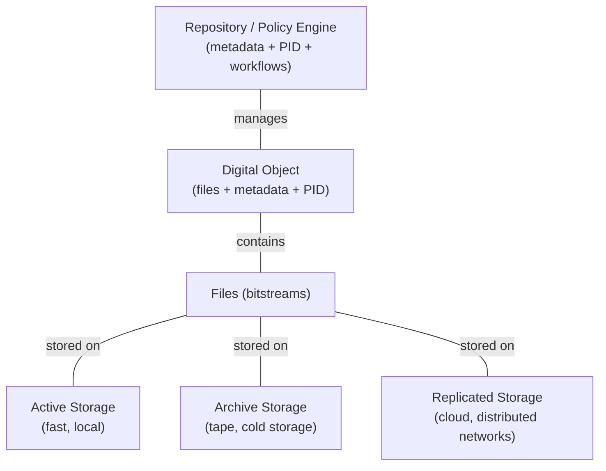

# Files and Storage Infrastructure

## What Are Files in Research Data Management?

Every digital research project begins with files. They are the most immediate and tangible artefacts researchers work with: a CSV exported from an instrument, a TIFF image from a microscope, a NetCDF model output, a PDF protocol, or a collection of scripts and notebooks. In Research Data Management (RDM), files are the **basic units of digital content** — the raw material from which more structured research outputs are eventually created.

At this early stage, files function simply as containers of information. They are produced quickly, modified frequently, and organised in ways that suit the researcher’s workflow. Their purpose is to support active work rather than long‑term preservation. As a result:

- their organisation reflects **workflow convenience**,  
- they rarely have **persistent identifiers**,  
- they are not yet accompanied by curated metadata,  
- but **metadata and provenance still need to be captured from the start**.

This is where FAIR already matters. Even though files are not yet curated or published, early decisions about naming, formats, folder structures, and documentation directly influence how findable, accessible, interoperable, and reusable the data will be later.

A key distinction emerges: files can be understood either as **working materials** — temporary, flexible, and often messy — or as **components of a future digital object**, which will eventually be curated, described, and preserved. Recognising when a file transitions from one category to the other is central to good RDM practice.

---

## A Fictive Example of a Dataset’s File Components

| File Type | Example | Purpose |
|----------|---------|---------|
| **Data file** | `soil_moisture_2020_2023.csv` | Contains the measurements |
| **Documentation** | `README.md` | Explains variables, units, and methods |
| **Code** | `cleaning_script.R` | Preprocessing and validation |
| **Configuration** | `sensor_metadata.json` | Sensor IDs, calibration, sampling frequency |

Each file plays a different role. Some — such as raw data or calibration metadata — may have value on their own. Others only make sense in combination with the rest.

Depending on the stage of the research data life cycle, these files may be treated as:

- **separate digital objects**, each with its own metadata and persistent identifier, or  
- a **file bundle**, representing a single conceptual dataset.

The appropriate choice depends on how the files will be used, shared, and preserved.

## Files as Separate Digital Objects vs. a File Bundle

### When Files Become Separate Digital Objects

Some files have scientific value **independent of the dataset they belong to**. They stand on their own as research outputs and therefore deserve their own metadata, identifier, and citation. This is especially true for primary research artefacts, such as:

- a single `.tif` microscopy image,  
- a `.fastq` sequencing file,  
- a `.nc` climate model output,  
- a `.bin` instrument dump from a field sensor.

These files are not merely components; they are **scientific objects** in their own right.

### When Files Form a Single Bundled Digital Object

In other cases, files are tightly interdependent and only make sense **together** as a coherent whole. Examples include:

- a dataset and its README,  
- a set of interdependent CSV files,  
- a collection of images forming a single study,  
- a dataset accompanied by a helper script.

Here, the files collectively represent one conceptual unit and are best deposited as a **file bundle** — a single digital object with multiple components.

## The Link to the Research Data Life Cycle

The question of when files should be treated as **digital objects** becomes clearer when viewed through the research data life cycle. As files move through the stages — **Process**, **Analyse**, **Archived**, and **Published** — they evolve from volatile working copies into curated, citable digital objects.

### Process — Active Research and Working Copies

During the **Process** stage, researchers generate and modify files rapidly: raw instrument outputs, logs, temporary results, scripts, and notebooks. These files typically live on local machines, lab servers, or compute systems such as HPC clusters or cloud VMs.

At this point:

- files are **provisional** and organised for workflow convenience,  
- they have **no persistent identifiers**,  
- and although **metadata and provenance must already be captured**, these records usually live in separate systems (ELNs, notebooks, workflow logs, version control).

This is also where **FAIR begins**. Early choices about naming, formats, and documentation shape later reuse.

A key distinction exists between:

- **working copies** on fast, ephemeral compute storage, and  
- **more durable storage** (project shares, institutional storage, version‑controlled repositories).

Working copies support efficient computation, but they are **not a substitute** for durable storage. Files left only on scratch space are at high risk of loss.

## Analyse — Derivation, Modelling, Transformation

In the **Analyse** stage, files begin to stabilise and gain **scientific identity**. Cleaned datasets, model outputs, and refined scripts emerge from raw materials. Researchers now distinguish between:

- **working files** (temporary outputs, debug runs, scratch data), and  
- **results worth keeping**, which are moved into more durable storage.

Some files now **cross the threshold** into **candidate digital objects** — for example, a cleaned dataset used in a figure, a reusable model output, a calibration file, or a canonical analysis script.

These files may still lack full metadata or a PID, but they are now:

- **stabilised**,  
- **relocated** to managed storage,  
- and **recognised** as research outputs.

This is the ideal moment to begin linking files, metadata, and persistent identifiers by coordinating storage solutions with metadata services, workflow engines, and institutional catalogues. Early alignment makes later archiving and publication far smoother.

## Archived — Long‑Term Retention as Digital Objects

By the **Archived** stage, key files have stabilised and are formally assembled into **digital objects**, marking the first step of the archiving process. The focus shifts from active analysis to **durability, integrity, and long‑term stewardship**. Files move into preservation‑oriented storage, while their metadata and persistent identifiers are registered and linked so the digital object remains coherent across systems.

Archived files emphasise:

- long‑term retention,  
- stable internal structure,  
- fixity,  
- migration to preservation‑oriented storage.

Storage systems such as tape or object stores hold the **files**, while metadata, provenance, and persistent identifiers are maintained in separate services. Because these components live in different places, they must be carefully coordinated.

At this stage, the digital object is fully defined, but its future — **publish**, **keep internal**, or **retire** — is still open.

## Published — Public Dissemination and Citation

In the **Published** stage, digital objects move from internal stewardship to **public, citable research outputs**. The emphasis shifts to **discoverability, transparency, and reuse**.

At this point:

- **FAIR principles guide the final structure** and metadata,  
- digital objects receive **globally resolvable persistent identifiers** (often DOIs),  
- components with independent value *may* be published as **separate digital objects**,  
- datasets are typically released as **coherent bundles**,  
- relationships between digital objects are made explicit.

A crucial element of publication is **findability**. Metadata portals, institutional catalogues, and disciplinary registries index the digital object’s metadata and expose it to search engines and aggregators. Discoverability comes from the **metadata**, not the files themselves.

In practice:

- files live on managed durable storage,  
- metadata lives in a catalogue or portal,  
- and the persistent identifier links the two.

Published digital objects are therefore more than preserved files: they are **curated, documented, and discoverable research outputs**, integrated into the wider scholarly ecosystem and ready for reuse.

## A Note on Terminology: From Files to Digital Objects

Although this chapter focuses on **files**, the discussion naturally expands into the broader concept of **digital objects**. This shift is intentional. In research practice, files rarely exist in isolation: once they stabilise, are moved to durable storage, or enter archival workflows, they become part of a **digital object**.

During the *Process* and *Analyse* stages, it is appropriate to speak primarily about **files**, because researchers interact with them as working artefacts. But once these files are stabilised, preserved, or prepared for dissemination, they transition into **digital objects**.

This conceptual shift reflects the reality of the research data life cycle:  
**files are the raw materials; digital objects are the curated, managed, and preservable units that persist beyond the immediate research workflow.**

By acknowledging this transition, the chapter can describe both the practical handling of files during research and their later role as components of durable, citable digital objects.

## Summary

- **Process / Analyse** → Files are created, transformed, and refined. Some begin to stabilise and may gain independent scientific value. 
- **Archived** → Stabilised files are preserved as parts of well‑defined digital objects, with coordinated storage, metadata, and persistent identifiers.  
- **Published** → Files with distinct roles or reuse potential are released as **separate digital objects**, while tightly interdependent files are published together as a **coherent bundle**.

This perspective clarifies when a file is simply a component of a dataset, and when it should be recognised as a **digital object in its own right**, complete with metadata, identity, and long‑term value.

Here is your revised *Storage Infrastructure* chapter with **Option 3 fully integrated**.  
I’ve inserted the clarification exactly where the term first appears and ensured the surrounding text flows naturally.

---

# Storage Infrastructure

**Storage infrastructure** is the technical environment where **files** are physically stored, replicated, and protected. Its role is intentionally narrow: storage systems manage **the underlying bits that make up a file (often called bitstreams)**, not digital objects. They ensure that files persist, but they do not provide the metadata, identifiers, or policies required to turn those files into fully managed digital objects.

Storage systems ensure that:

- files remain **intact** (fixity and integrity checking)  
- files remain **available** (redundancy and replication)  
- files remain **secure** (access control and encryption)  
- files remain **usable** (format migration and media refresh)  

Storage is therefore the **technical substrate** of preservation. It keeps the bits safe.  
But it does **not**:

- assign or manage persistent identifiers  
- maintain metadata  
- track provenance  
- enforce access policies  
- implement preservation workflows  

Those functions belong to **repository software** or other **policy engines**, which sit *above* storage and configure files into **digital objects**.

## Storage Types Commonly Used in RDM

| Storage Type | Characteristics | Typical Use |
|--------------|----------------|-------------|
| **Local institutional storage** (NAS/SAN) | Fast, controlled, campus‑managed | Active research data, working copies |
| **Cloud object storage** (S3, Azure Blob) | Scalable, distributed, API‑driven | Large datasets, collaborative access |
| **Tape archives** | Low cost, long retention, slower access | Long‑term preservation of files |
| **Distributed networks** (LOCKSS) | Multi‑site replication, federation | High‑resilience preservation of file copies |

Each storage type has different strengths. Most institutions use a **tiered storage model**, combining fast storage for active use with slower, cheaper storage such as **tape** for long‑term retention.

Across all tiers, the principle remains the same:  
**Storage systems store files. They do not manage digital objects.**

## Why Storage Infrastructure Matters

Storage infrastructure underpins the **durability** and **trustworthiness** of research files. It enables:

- **fixity checking** — detecting corruption or tampering  
- **redundant copies** — protecting against hardware failure or disasters  
- **scalable capacity** — accommodating growing datasets  
- **secure access** — supporting sensitive or embargoed data  
- **format and media migration** — ensuring files remain usable as technologies evolve  

Without robust storage, even the best‑described digital objects are at risk of loss or degradation.

But storage alone is not enough.  
To become a **digital object**, a file must be:

- registered in a repository or policy engine  
- associated with metadata  
- assigned a persistent identifier  
- managed through defined workflows  

Storage provides the **where**; repositories provide the **what**, **how**, and **why**.

## A Simple Analogy

- **Files** → the pages of a book  
- **Storage infrastructure** → the shelves, vaults, and climate‑controlled rooms that keep the pages safe  
- **Repository / policy engine** → the library system that catalogues the book, assigns a call number, and manages loans  
- **Metadata and PIDs** → the catalogue record and call number  

Storage protects the content; repositories provide the meaning, identity, and governance.

## A Diagrammatic View

This illustrates the essential separation:

- **Storage layers hold files.**  
- **Repositories configure files into digital objects.**

## Bringing It All Together

- **Storage systems manage files**, ensuring durability, integrity, and security.  
- **Repositories and policy engines manage digital objects**, providing metadata, identifiers, workflows, and lifecycle governance.  
- Storage ensures the persistence of bits; repositories ensure the persistence of meaning.

This separation of responsibilities is fundamental to modern research data management.

In the chapter [Data Repositories and Policy Engines](data-repositories.qmd), we explore how repositories build on top of storage systems to provide the metadata, identifiers, and workflows that digital objects require.
