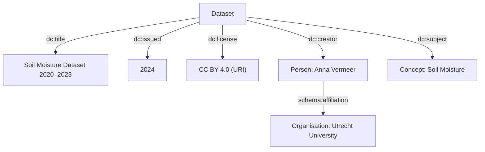

# Metadata

## What Is Metadata in Research Data Management?

In the context of Research Data Management (RDM), **metadata** is structured information that describes, explains, and contextualises a digital object—such as a dataset, document, image, or software file. It acts as a layer of documentation that makes a digital object **findable, understandable, and reusable**, both now and in the future.

Metadata typically captures:

* **Content information** — what the object contains
* **Provenance** — how, when, and by whom it was created
* **Technical characteristics** — file formats, structures, and software requirements
* **Administrative information** — rights, licences, and access conditions
* **Relationships** — links to other versions, datasets, or publications

In short, metadata provides the context needed to interpret and reuse data beyond its original purpose.

## Example: Metadata for a Published Dataset

## Example: Metadata for Code or Software Scripts

## Ontologies, Controlled Vocabularies, Metadata Schemas, and Templates

**Understanding the Building Blocks of Structured Research Metadata**

In Research Data Management, terms such as *ontologies*, *controlled vocabularies*, *metadata schemas*, and *metadata templates* are often used together. While closely related, they serve distinct roles. Together, they ensure that research outputs are described in a consistent, machine-readable, and interoperable way.

## Controlled Vocabularies

**Controlled vocabularies** are curated lists of approved terms used to describe data consistently.

### What they do

* Provide **standardised terms** for describing concepts
* Reduce ambiguity (e.g., “soil moisture” vs. “soil humidity”)
* Improve searchability and interoperability

### Examples

* AGROVOC (agriculture)
* MeSH (biomedical terms)
* GCMD keywords (Earth science)

### In practice

When a metadata field requires a *subject keyword*, a controlled vocabulary ensures that everyone uses the same term for the same concept.

##  Ontologies

**Ontologies** extend controlled vocabularies by not only defining terms, but also specifying the **relationships between them**.

### What they do

* Provide a **formal, machine-readable model** of concepts
* Define **hierarchies** (e.g., “soil moisture” is a type of “hydrological variable”)
* Enable reasoning and automated linking between datasets

### Examples

* Gene Ontology (GO)
* ENVO (Environment Ontology)
* PROV-O (Provenance Ontology)

### In practice

Ontologies allow machines to understand that terms like “precipitation” and “rainfall” are related, enabling more intelligent search and data integration.

## Metadata Schemas

A **metadata schema** defines *which fields* are used to describe a digital object and *how* those fields should be structured.

### What they do

* Specify required and optional fields
* Define field types (e.g., text, date, identifier)
* Ensure consistency across repositories and disciplines

### Examples

* Dublin Core (general-purpose)
* DataCite (research outputs)
* DDI (social sciences)
* CodeMeta (software)

### In practice

A metadata schema tells you *what information to provide*, such as:

* Title
* Creator
* Description
* Keywords
* Licence
* Persistent identifier

Importantly, it does **not** define which terms to use—that is the role of controlled vocabularies.

## Metadata Templates

A **metadata template** is a practical, user-friendly implementation of a metadata schema.

### What they do

* Provide **forms or structured documents** for data entry
* Translate schema fields into prompts
* Include guidance or examples
* Often embed controlled vocabularies (e.g., dropdowns or autocomplete)

### Examples

* A Zenodo upload form
* A Dataverse dataset form
* A lab-specific metadata spreadsheet
* A README template aligned with DataCite

### In practice

Templates are what researchers actually interact with. They operationalise schemas and often help enforce consistency.

## How They Fit Together

These components work together as complementary layers:

| Concept                     | Purpose                  | Relationship                          |
| --------------------------- | ------------------------ | ------------------------------------- |
| **Controlled vocabularies** | Standardised terms       | Provide the *values* used in metadata |
| **Ontologies**              | Concepts + relationships | Add semantic meaning and structure    |
| **Metadata schemas**        | Field definitions        | Specify *what* metadata to capture    |
| **Metadata templates**      | Practical tools          | Implement schemas for users           |

### A simple analogy

* **Controlled vocabularies** → the dictionary
* **Ontologies** → the dictionary plus relationships
* **Metadata schemas** → the blueprint
* **Metadata templates** → the form you fill in

### A real-world example

When uploading a dataset to Zenodo:

1. A schema (e.g., DataCite) defines the required fields.
2. The platform presents these fields through a template (web form).
3. Controlled vocabularies may guide keyword selection.
4. Ontologies may link your dataset to related concepts behind the scenes.

## Linked Data and Key–Value Metadata

Metadata can range from simple structures to fully semantic representations. Two key approaches are **key–value metadata** and **Linked Data**.

## Key–Value Metadata

Key–value metadata is the simplest and most widely used format. It consists of pairs:

* **Key** → the field name
* **Value** → the content

### Examples

* `title: Soil Moisture Dataset 2020–2023`
* `creator: Anna Vermeer`
* `license: CC BY 4.0`

### Characteristics

* Easy to create and understand
* Common in spreadsheets, JSON, YAML, and repository forms
* Human-readable, but limited in machine interpretation

### How it fits

* Schemas define the **keys**
* Controlled vocabularies constrain the **values**
* Templates present both to the user

Key–value metadata forms the foundation of most metadata practices.

## Linked Data

Linked Data is a more advanced, semantic approach that represents metadata as interconnected statements.

### Core idea

Information is expressed as **subject–predicate–object** triples:

* Dataset — *hasCreator* → Anna Vermeer
* Dataset — *hasSubject* → Soil Moisture
* Soil Moisture — *is a* → Hydrological Variable

Each element is identified by a **URI**, ensuring global uniqueness.

### Characteristics

* Highly interoperable
* Machine-interpretable
* Enables automated reasoning
* Connects datasets across systems

### How it fits

* Ontologies define relationships
* Controlled vocabularies provide stable identifiers
* Schemas can be expressed in machine-readable relationships (triples) using globally unique identifiers
* Templates may generate Linked Data automatically

Linked Data turns metadata into a **network of meaning**, rather than a collection of fields.

## A Simple Analogy

Describing a book:

* **Key–value metadata**

  * `title: The Hobbit`
  * `author: J.R.R. Tolkien`

* **Controlled vocabulary**

  * `subject: Fantasy Fiction`

* **Ontology**

  * Fantasy Fiction → is a → Fiction Genre

* **Schema** → defines the fields

* **Template** → the form

* **Linked Data** → a connected network (knowledge graph) of relationships

### Example

Below we are capturing the following metadata as key-value pairs.
This format reflects how metadata typically appears in spreadsheets, repository forms, or simple JSON/YAML files.

| **Field (Key)**  | **Value**                       |
| ---------------- | ------------------------------- |
| Title            | Soil Moisture Dataset 2020–2023 |
| Creator          | Anna Vermeer                    |
| Affiliation      | Utrecht University              |
| Publication Year | 2024                            |
| Subject          | Soil moisture                   |
| License          | CC BY 4.0                       |

* Each row is an independent field–value pair
* Relationships (e.g., between creator and affiliation) are **implicit**
* Values are plain text, with no global identifiers

The image below the *same metadata* expressed as a network of relationships.

* The **table** presents metadata as a **flat structure**
* The **graph** represents metadata as **connected entities**
* In the graph:

  * The *person*, *organisation*, and *subject* become **nodes**
  * Relationships (e.g., `creator`, `affiliation`) are **explicitly defined**

This is the key shift: from *fields with values* to *entities with relationships*.

## Bringing It All Together

* Key–value metadata is the **practical starting point**
* Linked Data is the **semantic, interoperable extension**
* Controlled vocabularies and ontologies provide **meaning**
* Schemas and templates provide **structure**

Together, they form the foundation of **FAIR, reusable research metadata**.

## Dublin Core, PROV-O, and Discipline-Specific Schemas

Metadata standards vary in scope—from general to highly specialised. Understanding how they complement each other helps in selecting the right approach.

## Dublin Core

A **general-purpose, lightweight metadata schema**.

### What it provides

* 15 core elements (e.g., Title, Creator, Subject, Date)
* Broad applicability across domains

### Why it’s useful

* Simple and widely supported
* Suitable for discovery and basic description

### Role

Provides **baseline descriptive metadata**.

## PROV-O

A **provenance ontology** describing how data was created.

### What it provides

* Entities, activities, and agents
* Relationships such as `wasGeneratedBy` and `used`

### Why it’s useful

* Supports reproducibility
* Captures workflows and processes

### Role

Adds **semantic provenance and process context**.

## Discipline-Specific Schema (Example: [Data Documentation Initiative](https://ddialliance.org/))

Data Documentation Initiative (DDI) organises metadata into three main levels:

| Level              | What it describes            | Examples                                    |
| ------------------ | ---------------------------- | ------------------------------------------- |
| **Study level**    | The overall research project | Title, investigators, methodology, sampling |
| **Dataset level**  | The data files               | File format, number of variables, version   |
| **Variable level** | Individual variables         | Question text, response categories, coding  |

The **variable level** is what makes DDI especially powerful.

### Study level

* Title: European Social Survey 2022
* Method: Survey
* Sample: Random sample of EU residents

### Dataset level

* File: `ess2022.csv`
* Cases: 30,000 respondents
* Variables: 250

### Variable level

* Variable: `trust_gov`
* Question: “How much do you trust the national government?”
* Values:

  * 0 = No trust
  * 10 = Complete trust

DDI enables researchers to understand:

* **what** the data contains (variables),
* **how** it was collected (methodology), and
* **how to reuse it correctly**.

### What it provides

* Detailed methodological and variable-level metadata
* Support for complex datasets

### Why it’s useful

* Captures domain knowledge essential for reuse

### Role

Provides **deep, field-specific context**.

Here’s a parallel, concise section for **ISA**, matching the style and level of detail of your DDI piece.

## ISA (Investigation–Study–Assay)

[ISA](https://isa-specs.readthedocs.io/en/latest/) is a **discipline-specific metadata framework** used in life sciences to describe experimental workflows, especially in genomics, proteomics, and other omics research.

ISA organises metadata into three hierarchical levels:

| Level             | What it describes                        | Examples                                       |
| ----------------- | ---------------------------------------- | ---------------------------------------------- |
| **Investigation** | The overall research context             | Project title, researchers, objectives         |
| **Study**         | A specific experiment or dataset         | Study design, subjects, sample characteristics |
| **Assay**         | Analytical measurements and technologies | Sequencing, mass spectrometry, protocols       |

👉 The **assay level** captures how data was actually generated.

### Investigation level

* Title: Gut Microbiome and Diet Study
* Objective: Analyse microbiome changes under different diets

### Study level

* Subjects: 100 participants
* Design: Controlled dietary intervention
* Samples: Stool samples collected weekly

### Assay level

* Technology: DNA sequencing
* Platform: Illumina
* Output: Microbial abundance profiles

ISA enables researchers to understand:

* **what was studied** (samples and subjects),
* **how experiments were conducted**, and
* **how measurements were generated**.

## How They Work Together

| Layer               | Purpose                       | Example                                    |
| ------------------- | ----------------------------- | ------------------------------------------ |
| General description | What is it?                   | Dublin Core                                |
| Provenance          | How was it created?           | PROV-O                                     |
| Domain detail       | What does it mean in context? | DDI (social sciences), ISA (life sciences) |

Together, these layers create **rich, FAIR, and interoperable metadata**.

## References
- https://www.w3.org/wiki/LinkedData
- https://www.w3.org/DesignIssues/LinkedData
- https://www.rd-alliance.org/group_output/rda-tdwg-attribution-metadata-working-group-final-recommendations/
- https://ddialliance.org/
- https://isa-tools.org/format/specification.html
