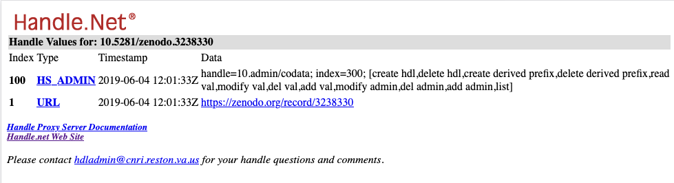
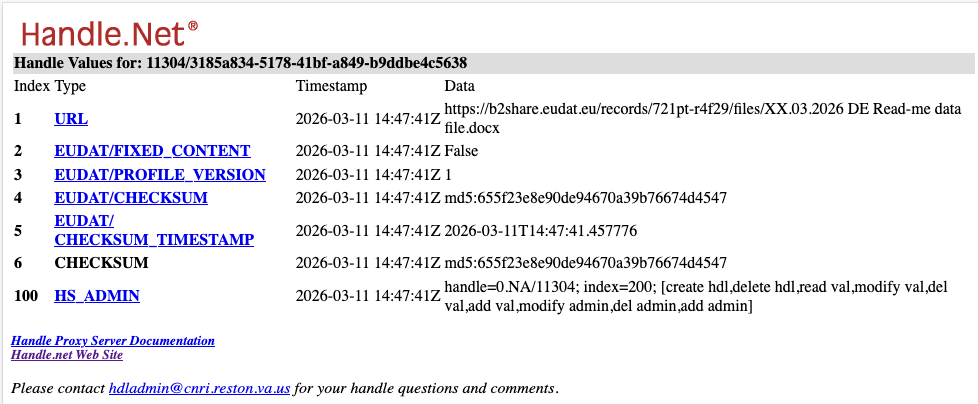

# Persistent Identifier Services

Persistent Identifier (PID) services are a fundamental component of modern research infrastructures and Research Data Management (RDM) systems. They provide stable, globally unique identifiers for digital and organizational entities within the research ecosystem. These entities include datasets, publications, software, researchers, institutions, research projects, and funding information.

A persistent identifier ensures that a digital object can be reliably referenced, discovered, and accessed over time, even if its physical location changes. PID services are typically operated by international organizations and integrated into repositories, publishing platforms, and research infrastructure services. By assigning persistent identifiers to digital objects and actors, these systems enable reliable citation, linking between resources, and automated machine processing.

Persistent identifiers also play a central role in enabling interoperable and FAIR‑compliant research infrastructures.

In this chapter we will focus on PIDs and PID services for digital objects, i.e. data. A general overview over PIDs can be found in the chapter  [Persistent Identifiers](pids.qmd).


## When to Assign a Persistent Identifier

When implementing an RDM service or infrastructure component, persistent identifiers directly support the **FAIR Data Principles**, particularly the first principle:

**[F1](https://www.go-fair.org/fair-principles/f1-meta-data-assigned-globally-unique-persistent-identifiers/). (Meta)data are assigned a globally unique and persistent identifier.**
"Principle F1 is arguably the most important because it will be hard to achieve other aspects of FAIR without globally unique and persistent identifiers."

However, not every piece of data produced during research requires a PID immediately. During early stages of the research data lifecycle, datasets may still be experimental, incomplete, or subject to frequent changes. Assigning persistent identifiers too early can lead to unnecessary versioning and administrative overhead.

A PID should typically be assigned once data becomes a **stable digital object**. Common situations in which a persistent identifier should be assigned include:

* **Data publication** in a repository
* **Long-term data archiving**
* Creation of **gold-standard datasets** or **reference datasets**
* When data is **shared beyond the boundaries of a single research team**


At this stage the digital object becomes part of the scholarly record and benefits from stable identification, discoverability, and citation.


## Persistent Identifier Systems and Services in the Research Ecosystem

Multiple persistent identifier (PID) systems exist to uniquely identify entities within the research ecosystem. Some focus on research outputs such as datasets and publications, while others identify people, institutions, or research activities. Below we list several PID systems commonly used for referencing datasets and digital objects.


### DOI (Digital Object Identifier)

The **Digital Object Identifier (DOI)** system, managed by the **DOI Foundation**, is one of the most widely used PID schemes in scholarly communication.

DOIs are primarily used to identify **digital research outputs**, including:

- datasets  
- journal articles  
- software  
- reports  

The DOI system is built on top of the **Handle System**, which provides the underlying resolution infrastructure.

Two major DOI registration agencies are widely used in research data management:

- **DataCite** – primarily assigns DOIs to datasets and research data  
- **Crossref** – primarily assigns DOIs to scholarly publications  

**Example DOI:**

```
10.5281/zenodo.3238330
```

### EPIC (European Persistent Identifier Consortium)

The **European Persistent Identifier Consortium (EPIC)** provides PID services **based on the Handle System infrastructure**. EPIC is widely used in **European research infrastructures and data services**.

EPIC identifiers are typically used for:

- identifying digital objects in research infrastructures  
- supporting long-term access to research data  
- linking datasets and research resources across distributed infrastructures  

Common users include:

- European research infrastructures  
- research data repositories  
- e-science services  

**Example EPIC Handle:**

```
21.T11998/0000-001A-3905-F
```

### Handle System

The **Handle System** is a **technical resolution infrastructure** developed by the **Corporation for National Research Initiatives (CNRI)**. It provides the distributed, persistent lookup mechanism used by several PID schemes.

The Handle System underpins:

- the DOI system  
- the EPIC PID service  

It is widely used by:

- repositories  
- digital libraries  
- research infrastructures  


### ARK (Archival Resource Key)

The **Archival Resource Key (ARK)** is a **separate PID system**, distinct from the Handle System. It was developed by the **California Digital Library** and is widely adopted in **libraries, archives, and cultural heritage institutions**.

ARKs are commonly used for identifying:

- digital collections  
- archival objects  
- digitized cultural heritage materials  

Unlike DOIs and EPIC identifiers, **ARKs do not rely on the Handle System**. They use their own resolution approach, typically through ARK-enabled service providers.

**Example ARK:**

```
ark:/12345/x54
```

## Spotlight on Handles, EPICs, DOIs

Persistent identifier (PID) infrastructures for digital resources are built on layered technical and governance frameworks. Systems such as the **Digital Object Identifier (DOI)**, the **Handle System**, and services provided by **EPIC** operate within the broader conceptual framework of the **Digital Object Network Architecture (DONA)**. Together they form an ecosystem that enables stable identification, management, and resolution of digital objects on the internet.

```{mermaid}
%%| label: fig-1
%%| fig-cap: The main organisations DONA, EPIC and DOI
%%| fig-align: center
%%{init: {
  "look": "handDrawn",
  "flowchart": { "htmlLabels": false}
}}%%

flowchart LR

    subgraph Technical_Infrastructure["Technical Infrastructure"]
        HANDLE["Handle System<br>(Global identifier system)"]
    end

    subgraph DOI_Framework["DOI Framework"]
        DOI["DOI<br>(Specialized identifier for scholarly outputs)"]
    end

    subgraph EPIC_Framework["EPIC Framework"]
        EPIC["EPIC<br>(Persistent identifiers for European research)"]
    end

    subgraph Global_Framework["Global Framework"]
        DONA["DONA<br>(Global management of digital objects)"]
    end

    HANDLE -->|Used by| DOI
    HANDLE -->|Used by| EPIC
    DOI -->|Part of| DONA
    EPIC -->|Part of| DONA

    linkStyle 0 labelPosition:0.5, align:top;
    linkStyle 1 labelPosition:0.5, align:top;
    linkStyle 2 labelPosition:0.5, align:top;
    linkStyle 3 labelPosition:0.5, align:top;
```

**The Handle System provides the underlying technical infrastructure for persistent identifiers.** It enables globally unique identifiers, known as *handles*, to be assigned to digital objects and resolved through a distributed network of handle servers. When a handle is queried, the system returns associated metadata, such as the current URL of the resource. This separation between the identifier and the object's location ensures persistence even when the resource moves.

Built on top of the Handle System is the Digital Object Identifier (DOI) system, a widely used persistent identifier scheme for scholarly publications, datasets, and other research outputs. **DOIs use the handle protocol for resolution but add additional governance, metadata standards, and registration workflows tailored to scholarly communication.** Organizations such as International DOI Foundation oversee the DOI framework and coordinate registration agencies that assign DOIs to digital objects.

The European Persistent Identifier Consortium (EPIC) is another major provider of persistent identifiers based on the Handle System. EPIC operates a handle registration service primarily aimed at research institutions, data infrastructures, and e-science projects in Europe. Unlike the DOI system, which focuses heavily on scholarly publishing workflows, **EPIC provides a more general handle-based PID service that can be used for datasets, research infrastructures, software, and other digital assets.**

At the architectural level, both DOI and EPIC-based handles operate within the principles of the Digital Object Network Architecture (DONA). **DONA defines a global infrastructure for digital object management, including the assignment of identifier prefixes, governance of the handle registry, and operation of root resolution services.** Through DONA, different identifier communities—such as DOI registration agencies and EPIC handle services—can coexist while sharing the same global resolution infrastructure.

In summary, DONA provides the overarching framework for managing digital object identifiers. The Handle System supplies the technical resolution mechanism within this framework. DOI represents a specialized, widely adopted identifier scheme built on handles, while EPIC operates as a consortium that provides handle-based persistent identifier services, particularly for European research infrastructures. This layered ecosystem enables long-term, interoperable identification and access to digital resources across diverse domains.

## Different Use of the Handle System: EPIC vs DOI

Although both European Persistent Identifier Consortium (EPIC) and the Digital Object Identifier (DOI) system use the Handle System for identifier resolution, they **use the Handle record in different ways**.

### EPIC: Metadata in the Handle Record

EPIC uses the Handle System **as a full PID infrastructure**, meaning that the **Handle record itself stores meaningful metadata** about the object. EPIC follows the **PID Information Types** model, which standardizes how information is encoded in Handle records.

Example Handle:

```
21.T11998/0000-001A-3905-F
```

A Handle record in EPIC may include multiple typed entries such as:

| Type             | Example Content                     | Purpose                        |
| ---------------- | ----------------------------------- | ------------------------------ |
| `URL`            | `https://repository.org/object/123` | Current location of the object |
| `CHECKSUM`       | `sha256:...`                        | Data integrity verification    |
| `EMAIL`          | `contact@repository.org`            | Administrative contact         |
| `10320/LOC`      | Multiple URLs                       | Location-aware resolution      |
| `PID_INFO_TYPES` | Reference schema                    | Declares metadata structure    |

In this model, the **Handle record itself functions as a lightweight metadata container**, enabling machines to retrieve essential information directly from the Handle infrastructure.


### DOI: Metadata Outside the Handle Record

In contrast, the DOI system uses the Handle System **primarily for resolution**, not for storing descriptive metadata.

A DOI such as:

```
10.1000/182
```

is technically implemented as a Handle, but the Handle record typically contains only minimal information, most importantly:

| Type  | Content                      |
| ----- | ---------------------------- |
| `URL` | Landing page of the resource |

The **actual metadata** for the DOI (title, authors, publication date, publisher, etc.) is **stored in external metadata registries** managed by DOI Registration Agencies such as Crossref or DataCite.

These agencies maintain **large metadata databases** that can be queried through APIs. For example:

* Crossref metadata API
* DataCite metadata store

When someone resolves a DOI through `doi.org`, the Handle system simply redirects the user to a **landing page**, while the rich metadata is retrieved from the registration agency's infrastructure rather than from the Handle record itself.


The difference can be understood as two architectural approaches:

| Feature           | EPIC Handles                | DOIs                         |
| ----------------- | --------------------------- | ---------------------------- |
| Infrastructure    | Handle System               | Handle System                |
| Metadata location | Inside the Handle record    | External metadata registries |
| Metadata model    | PID Information Types       | DOI metadata schemas         |
| Resolution        | Directly from Handle record | Redirect to landing page     |
| Example prefix    | `21.*`                      | `10.*`                       |

Thus, EPIC uses the Handle System as a metadata‑aware PID infrastructure, designed to support interoperability across research infrastructures and to maintain actionable links between data objects, services, and workflows. In contrast, the DOI system uses the Handle System primarily as a resolution layer, while the descriptive metadata and publication‑oriented services are maintained in separate, domain‑specific registries such as DataCite and Crossref.

Whereas DOIs are embedded in the scholarly publishing ecosystem—complete with citation metadata, indexing in bibliographic databases, and integration with publication workflows—EPIC identifiers are optimized for technical interoperability, enabling research infrastructures to reference, connect, and manage data objects across distributed systems. In other words, DOI focuses on publication, discoverability, and metadata indexing, while EPIC focuses on infrastructure‑level persistence, machine‑actionable metadata, and cross‑system integration.


```{mermaid}
%%| label: fig-3
%%| fig-cap: Deeper look into the technologies and organisations
%%| fig-align: center
%%{init: {
  "look": "handDrawn",
  "flowchart": { "htmlLabels": false}
}}%%
flowchart TB

    %% Top-level
    DONA["Digital Object Network Architecture (DONA)"]
    GHR["Global Handle Registry"]
    HANDLE["Handle System<br>(Identifier resolution infrastructure)"]

    %% Branches
    EPIC["EPIC Handle Services"]
    DOI["DOI System"]

    %% Handle record contents
    EPIC_REC["Handle Record contains:<br>• URL<br>• PID Information Types<br>• checksums<br>• admin data<br>• service endpoints"]

    DOI_REC["Handle Record contains:<br>• URL<br>• minimal metadata"]

    %% Metadata flows
    EPIC_META["Machine‑actionable PID metadata<br>stored in Handle infrastructure"]

    DOI_META_SRC["Metadata stored externally<br>in DOI Registration Agencies"]

    DOI_META_DB1["DOI metadata databases"]
    DOI_META_DB2["DOI metadata databases"]

    %% Structure
    DONA --> GHR --> HANDLE

    HANDLE --> EPIC
    HANDLE --> DOI

    EPIC --> EPIC_REC --> EPIC_META

    DOI --> DOI_REC --> DOI_META_SRC
    DOI_META_SRC --> DOI_META_DB1
    DOI_META_SRC --> DOI_META_DB2

```

We can see how the Handle System is used differently in practice by comparing two PIDs: `10.5281/zenodo.3238330` and `11304/3185a834-5178-41bf-a849-b9ddbe4c5638`.

The first identifier is a DOI. If we resolve it through the Handle System using `https://hdl.handle.net/10.5281/zenodo.3238330?noredirect` we can inspect the metadata stored directly in the Handle record.

{fig-align="center"}

This record contains two standard fields:

- HS_ADMIN — an administrative entry that defines 
	- which Handle identity (usually the prefix administrator) controls the handle
	- what permissions that identity has
	- which operations they are allowed to perform. This entry is part of every Handle record, whether it belongs to EPIC, DOI, or another service.
- URL — the target location the resolver redirects to when the handle is used.

Every Handle record includes at least these two entries.

Now let’s look at `11304/3185a834-5178-41bf-a849-b9ddbe4c5638` - an EPIC example:



Here we again see the mandatory HS_ADMIN and URL fields. In addition, the organisation responsible for this prefix has added extra information. These additional fields come from a custom PID profile used by [EUDAT](https://eudat.eu) for their B2SHARE data publishing service.

In this case, the PID points directly to a file and includes useful details such as the file’s checksum. This allows users or systems to verify the file’s integrity, for example during data migration or when downloading the file.

## Resolution of Persistent Identifiers

To understand how persistent identifiers function behind the scenes, it helps to look at **how a resolver retrieves the information stored in a Handle record**. Resolution is simply the process of turning an identifier into the current location or metadata of the object it represents.

Using the **Handle System** as an example, the process works like this:

When a user enters a Handle such as `21.T11998/0000-001A-3905-F` into a resolver—or clicks a link containing it—the request is sent to the global Handle infrastructure operated by the **Corporation for National Research Initiatives (CNRI)**.

```{mermaid}
%%| label: fig-4
%%| fig-cap: The Handle resolution
%%| fig-align: center
%%{init: {
  "look": "handDrawn",
  "flowchart": { "htmlLabels": false }
}}%%

flowchart TB

    REQ[Browser: Send request<br>10.5281/zenodo.3238330]
    PREFIX[Lookup prefix 10.5281 at global Handle server]
    LOCAL[Contact local server<br>which hosts all PIDs for 10.5281]
    RECORD[Get handle record]
    REDIR[Redirect to resource in URL field]

    REQ --> PREFIX --> LOCAL --> RECORD --> REDIR

```

The resolver then performs a series of steps:

1. **Request submission**  
   The user or application sends the Handle to a resolver service.
2. **Prefix lookup ** 
   The resolver checks the prefix (the part before the slash) to determine which Handle server is responsible for that identifier.
3. **Local server query ** 
   The resolver contacts the appropriate server and requests the Handle record.
4. **Record retrieval**  
   The server returns the stored entries—typically including a URL pointing to the current location of the object, along with administrative fields such as HS_ADMIN.
5. **Redirection**  
   Using the URL entry, the resolver redirects the user or system to the resource’s current location.

Because the Handle record can be updated whenever the underlying resource moves, the identifier itself remains stable. This is the same principle described in the previous chapter: the PID stays the same, only the target information changes, ensuring long‑term access even as systems evolve.

Understanding resolution tells us how a PID behaves once it exists. The next step is to look at how such identifiers come into being. This brings us to the two core building blocks of the Handle System: **minting a Handle** and **managing the Handle record**.

# Minting Handles and the Handle Record

Persistent identifiers are only useful if they can be **created, stored, and updated reliably**. In the **Handle System**, this is achieved through two core concepts: **minting a Handle** and **maintaining the Handle record**.

## Minting Handles

*Minting* a Handle means **creating and registering a new persistent identifier** for a digital object.

Organisations participating in the Handle System receive a **prefix** (for example from EPIC). They then generate a unique **suffix** for each object they want to identify. Together, these form a globally unique Handle:

```
prefix/suffix
```

- **Prefix** – identifies the organisation responsible for the identifier  
- **Suffix** – uniquely identifies the object within that organisation  

Example:

```
21.T11998/0000-001A-3905-F
```

Once minted, the Handle is registered in the global Handle infrastructure and can be resolved using the mechanism described in the previous chapter.

## The Handle Record

Every Handle points to a **Handle record**, which stores the information needed for resolution. At minimum, a record contains:

- a **`URL` entry**, indicating where the resolver should redirect the user  
- an **`HS_ADMIN` entry**, defining who controls the Handle and what permissions they have  

Depending on the use case, additional entries may be included.  
For example, EPIC Handles often store:

- checksums  
- protocol information  
- service endpoints  
- machine‑actionable metadata  

This flexibility allows Handles to describe not only web resources but also files, collections, workflows, or non‑HTTP services.

When the location of a digital object changes, only the **Handle record** needs to be updated.  
The identifier itself remains stable, ensuring **persistent and reliable access** over time.
The same is actually also true for all other information which is captured in the PID metadata.


## Practical Example: Creating an EPIC Handle and Managing Its Metadata

To demonstrate how Handle‑based PIDs are created and managed in practice, this example uses **pyhandle**, a Python library developed by **EUDAT**.  
EUDAT maintains large‑scale European research data services, and `pyhandle` is their official client library for interacting with **EPIC Handle services** through the Handle REST API.

Before you can mint Handles, you need **credentials** issued by your Handle service provider (for example, EPIC or a local institutional Handle server). These credentials typically include:

- the **Handle prefix** assigned to your organisation  
- a **username** associated with that prefix  
- a **private key** or password for authentication  
- optional permissions for reverse lookup or administrative actions  

They are usually delivered as a small JSON file (often named `credentials.json`) that `pyhandle` can read directly.

With that context in place, the following steps show how to mint a Handle, add metadata, update its target location, and manage non‑HTTP resources.

### 1. Install the Python Library

```python
!pip install pyhandle
```

---

### 2. Imports

```python
from pyhandle.clientcredentials import PIDClientCredentials
from pyhandle.handleclient import PyHandleClient
```

---

### 3. Connect to the Handle Server

Here we load the credential file provided by EPIC (or your institutional Handle service) and create a client authenticated for minting and updating Handles.

```python
cred = PIDClientCredentials.load_from_JSON("credentials.json")
client = PyHandleClient('rest').instantiate_with_credentials(cred)
```

---

### 4. Minting a Handle

```python
handle = client.generate_PID_name(cred.get_prefix())
print(handle)
```

Example output:

```
21.T12996/a70da9ee-1202-451f-89ba-37d907fea470
```

---

### 5. Adding Metadata

```python
meta = {"checksum": "blablabla"}
meta["URL"] = "http://google.com"
client.register_handle_kv(handle, **meta, overwrite=False)
```

---

### 6. Updating Handle Metadata

```python
yoda_data_loc = "https://data.yoda.uu.nl/research-christine/my_books/"
meta["data_type"] = "collection"
meta["protocol"] = "webdav"
meta["URL"] = yoda_data_loc
client.modify_or_add_handle_value(handle, **meta)
```

Delete metadata:

```python
client.delete_handle_value(handle, "checksum")
```

---

### 7. Minting EPIC Handles for Non‑HTTP Resources

EPIC allows Handles to describe resources that are not directly accessible via HTTP, such as iRODS paths or WebDAV collections. In such cases, the Handle may include protocol‑specific metadata and a `URL` that points to a resolver landing page rather than the resource itself.

```python
handle2 = client.generate_PID_name(cred.get_prefix())
meta2 = {
    "protocol": "iRODS",
    "irods_path": "/uu/home/research-christine/my_books",
    "irods_server": "data.yoda.uu.nl",
    "URL": f"https://hdl.handle.net/{handle2}?noredirect"
}
client.register_handle_kv(handle2, **meta2, overwrite=False)
```

Example:

```
21.T12996/24c4010d-1527-409b-953b-8c8548d3330a
```

---

### 8. Searching and Managing Handles

Some Handle services allow **reverse lookup**, meaning you can search for Handles based on metadata values (e.g., a URL or checksum). This requires additional credentials with search permissions.

```python
search_client = PyHandleClient("rest").instantiate_for_read_and_search(
    handle_server_url="https://your.local.handle.server",
    reverselookup_password="your_password",
    reverselookup_username="21.T12996"
)
result = search_client.search_handle(URL="/myfile/here/local.txt")
print(result)
```


## References
- https://www.go-fair.org/fair-principles/


